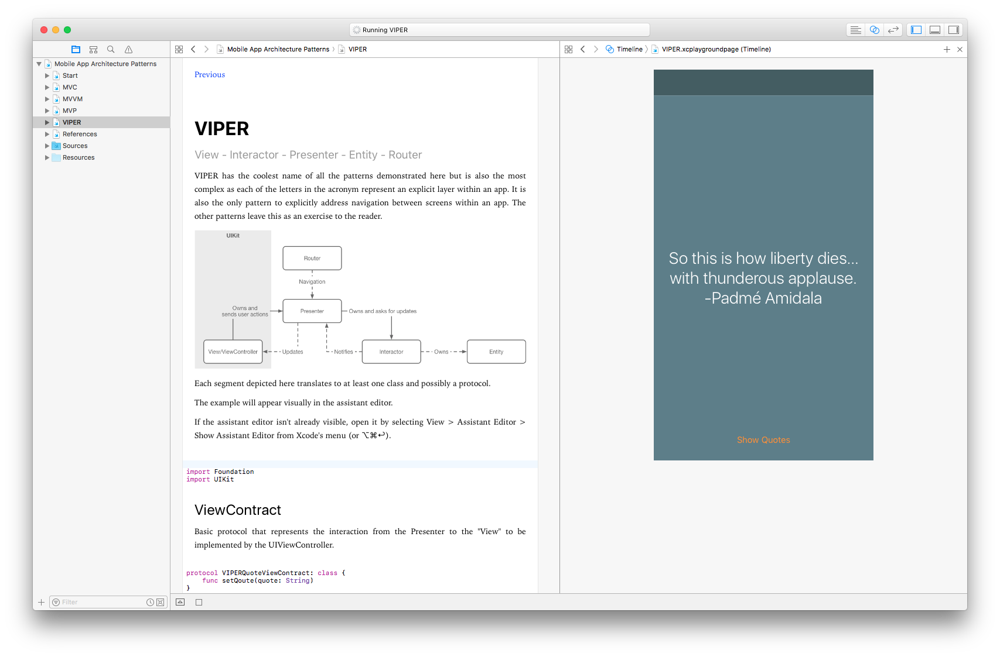

# Common Architectural Patterns in iOS Development

This playground demonstrates four different architectural styles used in iOS app development. The examples are concise and short to demonstrate the patterns for comparing and contrasting.

* MVC
* MVVM
* MVP
* VIPER

